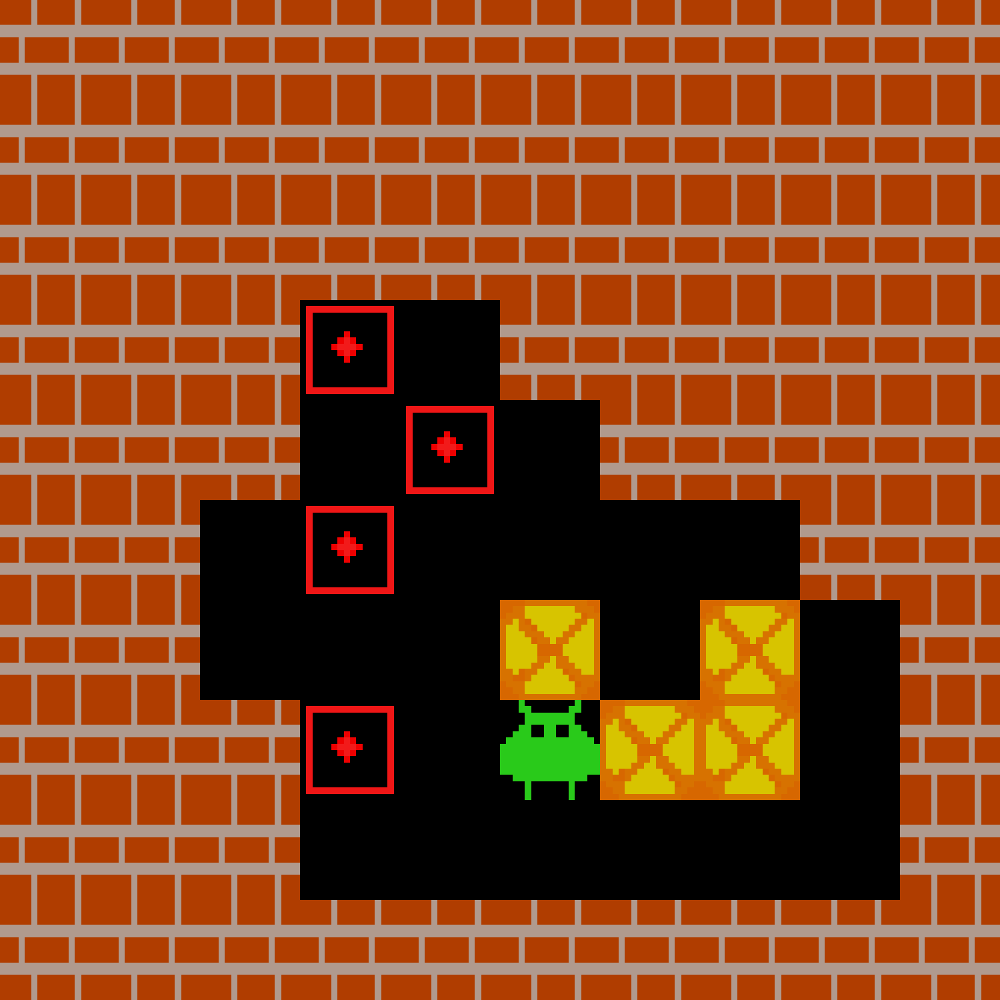

<div align="center">
    <h1 align=center>Guided Domain Solver: Structured Exploration of Domain-Specific Tasks with Large Language Models</h1>
</div>

<div align="center">
    <em>
    This project presents a method to solve domain-specific problems by leveraging Monte Carlo Tree Search (MCTS), Knowledge Graphs and Large Language Model (LLM) agents. At the core of this approach lies a MCTS algorithm that explores the complex solution space of a given domain in a goal-directed and sample-efficient manner. In the expansion phase of the MCTS, a domain-specific knowledge graph is incorporated to encode concepts, relationships and constraints. This structured representation enables an LLM agent to make informed decisions for the node expansion. By combining a structured search of the solution space through MCTS, a representation of domain knowledge through the Knowledge Graph and the generalization abilities of an LLM agent, this method can solve complex tasks in domains where both creativity and adherence to expert rules are essential. In a first step, this approach is used to solve Sokoban, a puzzle game that requires planning and creativity to place several boxes at specific targets with as few moves as possible.
    </em>
</div>

<br/>

<div align="center">
<a href="https://www.python.org/doc/versions/" target="_blank"></a>
<a href="tests/coverage.txt" target="_blank"></a>
<a href="tests/coverage.txt" target="_blank"></a>
</div>

<br/>

<div align="center">
    <strong><a href="#description">Description</a></strong>
    <strong> | </strong>
    <strong><a href="#installation">Installation</a></strong>
    <strong> | </strong>
    <strong><a href="#examples">Examples</a></strong>
    <strong> | </strong>
    <strong><a href="#results">Results</a></strong>
</div>

<br/>

<div align="center">
    
</div>

<br/>

## Description

The algorithm is based on a Monte Carlo Tree Search (MCTS) to find a solution for the Sokoban game. It involves the steps of selection, expansion, simulation, and backpropagation, which are repeated several times. The resulting search tree is stored in the Knowledge Graph. The individual steps are described in the following chapters.

### Selection

During the selection phase of MCTS, the algorithm traverses the current search tree to identify the most promising node for further investigation. Normally, an upper confidence bound for trees is used to find a balance between exploitation and exploration. In the first step of the Sokoban game, only exploitation is used here, as it is a relatively small domain. Thus, the most promising node that still contains unexplored actions is selected.

Once the node has been selected, the Knowledge Graph is updated with the current game status. The game is divided into static, dynamic, and action layers. The nodes of the static layer are set at the beginning and do not change during the game. All moving objects are mapped in the dynamic layer. The action layer determines the possible actions that can be performed in the current status.


<div align="center">
    
</div>

The nodes of the floors contain the target positions of the boxes as properties. In the relations, the positions of the player and the boxes on the playing field are encoded. This allows effective queries to be performed to determine which box is closest to the player or which box can be placed the fastest.

### Expansion

In the expansion step, the search tree is extended with a new node. Multiple queries are made on the Knowledge Graph, which summarize the current state of the game and game states that have already been reached. With this information, an LLM agent is prompted to execute the next action in the game state:

<pre style="white-space: pre; overflow-x: auto;">
system:  You are a player which tries to solve a Sokoban game. 
         Keep the reasoning short. 
         Respond only with a single action out of ['UP', 'DOWN', 'LEFT', 'RIGHT'].

human :  Use the following results retrieved from a database to provide the next action for the Sokoban game.
         Environment: {environment}
         Shortest paths to place remaining boxes: {shortest_paths_to_place_remaining_boxes}
         Attempted Actions: {attempted_actions}
         Possible Actions: {possible_actions}
         Action:
</pre>

It would be possible to implement an agent system that independently executes queries on the Knowledge Graph. Since the Sokoban game keeps a similar structure, using pre-made cypher queries is more reliable.

### Simulation

In the simulation phase, the result of the newly added node is evaluated by simulating a trajectory from this point to a final state using an efficient policy. Normally, a ratio of games won/lost is used to determine the value of the game state. Since the Sokoban game has a very sparse distribution of games won, finding a solution using this method can take considerably longer. Here, it is possible to take advantage of the fact that the possible game states of Sokoban are finite. Therefore, the remaining steps to solve the game state are used as the value of the game state. This evaluation is determined using a breadth-first search, which represents an error-free evaluation of the game state and cannot be achieved in many other domains.

### Backpropagation

In the backpropagation step, the result of the simulation is propagated back through the search tree, updating the value estimates of each node along the path. In the case of the Sokoban game, the update rule of n-step temporal difference learning is applied here:

$$
V(s_t) \leftarrow V(s_t) + \alpha \left[ \sum_{k=0}^{n-1} \gamma^k r_{t+k+1} + \gamma^n V(s_{t+n}) - V(s_t) \right]
$$

The update is applied upwards on each node in the search tree. During the update, the number of steps in the temporal difference learning update rule depends on how deep the simulated node is in the search tree. The reward $r$ is the determined value of the simulation. The learning rate $\alpha$ and the discount factor $\gamma$ can be tuned.

## Installation

This guide walks you through setting up the environment required to run the repository. It covers setting up the project locally from its repository, along with installing and configuring a Neo4J database and an Ollama agent system.

Make sure the following are installed on your system:

- [Python 3.10](https://www.python.org/downloads/)
- [Neo4J Desktop or Neo4J Aura](https://neo4j.com/download/)
- [Ollama](https://ollama.com/)
- [Git](https://git-scm.com/)

### Repository Setup

Clone the repository and install the Python dependencies in a virtual environment:

```bash
git clone <copied URL>
cd <new directory>

# Create and activate a virtual environment
python -m venv venv

# For Windows
venv\Scripts\activate.bat

# For macOS/Linux
# source venv/bin/activate

# Install repository dependencies
pip install -r requirements.txt
```

### Neo4J Database

Create an empty Neo4J database instance and ensure the [APOC plugin](https://neo4j.com/docs/apoc/current/installation/#apoc) is installed and activated.

To connect the repository to your Neo4J instance, create a `.env` file inside the <a href="src/" target="_blank">`src/`</a> directory with the following content:

```
NEO4J_URI = <URI for Neo4j database>
NEO4J_USERNAME = <Username for Neo4j>
NEO4J_PASSWORD = <Password for Neo4j>
```

Replace the values with the credentials for your Neo4J instance and make sure the database is running.

### Ollama Agent System

Pull the required model using Ollama:

```bash
ollama pull qwen3:8b
```

This command downloads the qwen3:8b model that the agent system will use during runtime.
Make sure the Ollama service is running in the background.

## Examples

This example demonstrates how to solve the default Sokoban environment. 
The MCTS algorithm is modular and allows you to plug in custom strategies for each phase of the search: selection, expansion, simulation, and backpropagation.

```python
from mcts.mcts import Builder
from mcts.selection import selection
from mcts.expansion import expansion
from mcts.simulation import simulation
from mcts.backprop import backprop
from environment.environment import SokobanEnvImpl

# Build the solver with custom strategies
solver = (Builder()
          .setSelection(selection)
          .setExpansion(expansion)
          .setSimulation(simulation)
          .setBackprop(backprop)
          .build())
# Initialize the default Sokoban environment
env = SokobanEnvImpl(use_default_env=True)
# Solve the environment and save logs to the specified path
solver.solve(env, log_path="<Path>")
```

The solved environment and detailed logs (including the solution) will be saved to the specified `<Path>`. 
The algorithm solves the default Sokoban environment with the shortest trajectory of 30 moves:

<div align="center">
    
</div>

Unseen Sokoban enviroments can be generated with the following:

```python
# Generate new Sokoban environment that resets to starting point
env = SokobanEnvImpl(max_steps=60).as_fixated()
```

The algorithm finds the shortest possible trajectory to solve the Sokoban enviroment.
Below are some generated Sokoban environments that have been solved optimally:

<div class="collage">
  <div class="row" align="center">
    
    
    
  </div>
  <div class="row" align="center">
    
    
    
  </div>
</div>

More examples can be found in the  <a href="docs/" target="_blank">`docs/`</a> directory.

## Results

For the Sokoban game, solutions will be achieved that need the same number of steps to solve the game as the optimal solution. This is made possible by the optimal function within the simulation step.

Various approaches were tried for the expansion step. One was expansion with a random possible action. In comparison, random sampling takes a random action from the shortest paths to place the unplaced boxes. The final approach was to use an LLM agent that receives all the information about the environment as well as the shortest paths to place the unplaced boxes. The LLM agent is qwen3:8b, a relatively small LLM.

<div align="center">
    
</div>

The plot shows a comparison of the different variants in a greedy selection scenario. An error-free expansion would generate a branching factor of 1, which means that the best action is always taken. It can be seen that the LLM agent is able to make better decisions than the other variants. However, it requires significantly more time for evaluation and reasoning.